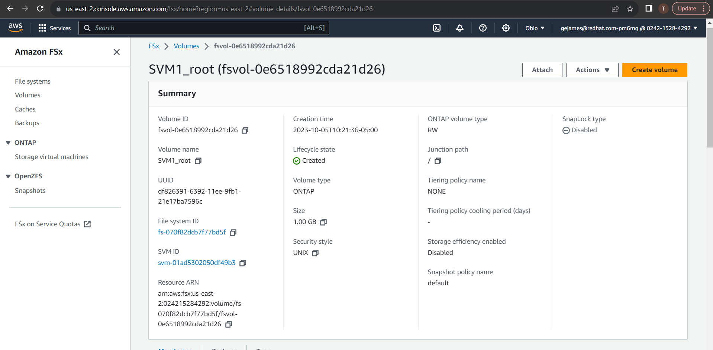
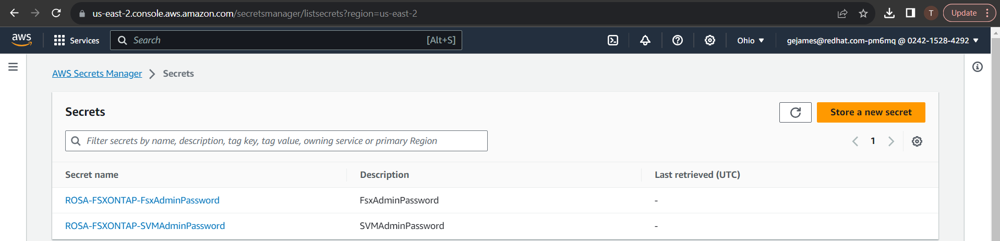
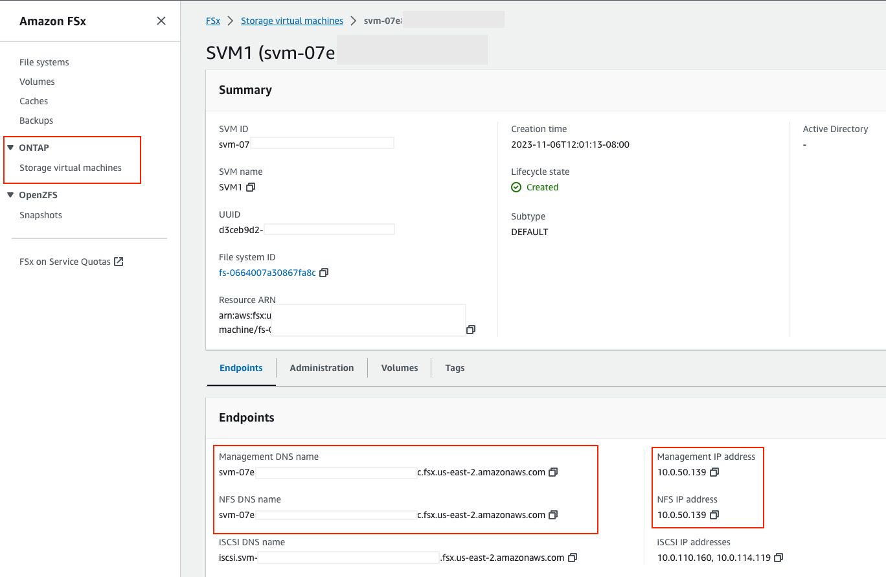

= ROSA FSx Workshop

This lab guide provides a walkthrough on using FSx for ONTAP as a persistent storage layer for *Red Hat OpenShift Service on AWS* (ROSA) applications. It will guide you through the steps required to install the NetApp Trident Container Storage Interface (CSI) driver on a ROSA cluster. Additionally, you will learn how to provision an FSx for ONTAP file system, deploy a sample stateful application, and how to scale pods with dynamic persistent volumes. To ensure your data’s resilience, the guide concludes with instructions on how to backup and restore your applications. 

This solution facilitates the creation of a shared storage system that can not only extend across Availability Zones (AZs) but also simplifies the tasks of scaling, protecting, and recovering your data with the Trident CSI driver.

NOTE: Red Hat associates that have access to the Red Hat Demo Platform (RHDP) can launch the ROSA FSx Workshop for a lab environment.

This lab guide assumes you are using the RHDP environment.

Once you have the lab environment ready,  SSH into the bastion and follow the steps below.

Steps: 

  . <<provision-fsx-for-ontap, Provision FSx for ONTAP>>
  . <<install-web-terminal, Install OpenShift Web Terminal>>
  . <<install-and-configure-the-trident-csi-driver-for-rosa, Install and Configure the Trident CSI driver for ROSA>>
  . <<deploy-sample-mysql-stateful-application,Deploy a Sample MySQL Stateful Applicaiton>>
  . <<scale-mysql-application-pods,Scale MySQL Application Pods>>
  . <<backup-and-restore-with-snapshots,Backup and Restore with Snapshots>>

[[provision-fsx]]
== Provision FSx for ONTAP 

[[clone-github-repository]]
=== Clone GitHub repository 

NOTE: This portion of the lab can be done from the FSx ROSA bastion as it already has the aws cli command installed and logged in

Clone the git repository:

[source,bash]
----
git clone https://github.com/redhat-gpst/rosa-fsx.git
----

cd into the rosa-fsx/fsx directory

[source,shell]
----
cd ~/rosa-fsx/fsx
----

We will create a single-AZ FSx for ONTAP file system in the same VPC as the ROSA cluster.

From the bastion, run the following command.  

[source,bash]
----
aws ec2 describe-subnets --query 'Subnets[*].{SubnetId:SubnetId,VpcId:VpcId,CidrBlock:CidrBlock}' \
   --output table
----

Output from commands will be showin in a box like below.

[listing]
----
-------------------------------------------------------------------------
|                             DescribeSubnets                           |
+----------------+----------------------------+-------------------------+
|    CidrBlock   |         SubnetId           |          VpcId          |
+----------------+----------------------------+-------------------------+
|  10.0.0.0/17   |  subnet-0c1e3b083f692a17f  |  vpc-0994809fd6f55252b  |
|  192.168.0.0/24|  subnet-01b8fa59d97657eca  |  vpc-0a4106cf5b3b895b5  |
|  10.0.128.0/17 |  subnet-0299fe13ba470aa9f  |  vpc-0994809fd6f55252b  |
+----------------+----------------------------+-------------------------+
----

Run the following command to assign the SubnetId to SUBNETID

[source,bash]
----
export SUBNETID=$(aws ec2 describe-subnets --query 'Subnets[?CidrBlock==`10.0.0.0/17`].SubnetId' \
   --output json | jq -r '.[0]')
----

Run the following command to assign the VpcId to VPCID

[source,bash]
----
export VPCID=$(aws ec2 describe-subnets --query 'Subnets[?CidrBlock==`10.0.0.0/17`].VpcId' \
   --output json | jq -r '.[0]')
----

Run the following command to create the stack

[source,shell]
----
aws cloudformation create-stack \
  --stack-name ROSA-FSXONTAP \
  --template-body file://./FSxONTAP.yml \
  --region us-east-2 \
  --parameters \   
     ParameterKey=Subnet1ID,ParameterValue=$SUBNETID \
     ParameterKey=myVpc,ParameterValue=$VPCID \
     ParameterKey=FileSystemName,ParameterValue=ROSA-myFSxONTAP \
     ParameterKey=ThroughputCapacity,ParameterValue=512 \
     ParameterKey=FSxAllowedCIDR,ParameterValue=10.0.0.0/16 \
     ParameterKey=FsxAdminPassword,ParameterValue=Rosa12345 \
     ParameterKey=SvmAdminPassword,ParameterValue=Rosa12345 \
  --capabilities CAPABILITY_NAMED_IAM
----
NOTE: This can take 20 - 30 minutes. You can monitor the progress of the stack creation from AWS Console -> CloudFormation -> Stacks -> ROSA-FSXONTAP -> Events

Verify your file system and storage virtual machine (SVM) has been created using the Amazon FSx console. 

[[install-web-terminal]]
== Install Web Terminal
For the rest of lab we will use the `Web Terminal` OpenShift operator.  This has access to the FSx SVM and the `oc` command already configured.

Log into the OpenShift Web Console and install the `Web Terminal` from the Operator Hub.

// screenshot of web-terminal

Open the web terminal from the shortcut on the upper right corner of the Console screen.  You may have to refresh your browswer for the icon to show.

[[config-trident]]

== Install and configure the Trident CSI driver for ROSA 

// In order to use the `oc` command, you may have to first login.  

// Visit the OCP Web UI for the API URL.  Then use the API URL to login.

// Example:

// [source, bash]
// ----
// [rosa@bastion]$ oc login https://api.rosa-6slmk.qkm6.p1.openshiftapps.com:6443
// You must obtain an API token by visiting https://oauth-openshift.apps.rosa-6slmk.qkm6.p1.openshiftapps.com/oauth/token/request

// [rosa@bastion]$ oc login --token=sha256~Bt3c-m2dTmmHqGlo-xxxxxxxxxxxxxxxxxxxxxxxx --server=https://api.rosa-6slmk.qkm6.p1.openshiftapps.com:6443

// Logged into "https://api.rosa-6slmk.qkm6.p1.openshiftapps.com:6443" as "cluster-admin" using the token provided.

// You have access to 100 projects, the list has been suppressed. You can list all projects with 'oc projects'
// ----

Clone the git repository into the web-terminal and cd into the ros-fsx/fsx directory

[source,bash]
----
git clone https://github.com/redhat-gpst/rosa-fsx.git
cd ~/rosa-fsx/fsx
----

We will be installing the Trident CSI driver in the Openshift “trident” namespace. 

[source,shell]
----
oc create ns trident
----

Verify the namespace was created

[source, bash]
----
oc get ns trident
----
[listing]
NAME      STATUS   AGE
trident   Active   1h

Next, download the Trident CSI driver from github:

[source,shell]
----
cd ~/rosa-fsx/fsx/
curl -L -o trident-installer.tar.gz \ 
  https://github.com/NetApp/trident/releases/download/v22.10.0/trident-installer-22.10.0.tar.gz
----

Then, extract the contents:

[source,shell]
----
tar -xvf ./trident-installer.tar.gz
----

Use the following helm command to install the Trident CSI driver in the “trident” namespace on the OpenShift cluster.

[source,shell]
----
cd ~/rosa-fsx/fsx/trident-installer/helm 
helm install trident -n trident trident-operator-22.10.0.tgz
----

Run the following command to verify the Trident driver installation.

[source,shell]
----
helm status trident -n trident
----
[listing]
----
NAME: trident
LAST DEPLOYED: Mon Nov  6 20:52:31 2023
NAMESPACE: trident
STATUS: deployed
REVISION: 1
TEST SUITE: None
NOTES: ...truncated...
----

=== Create secret to store the SVM username and password in ROSA cluster

Create a new file with the SVM username and admin password, and save it as `svm_secret.yml`. 

A sample `svm_secret.yml` file is included in the fsx folder.

[source,yaml]
----
apiVersion: v1
kind: Secret
metadata:
  name: backend-fsx-ontap-nas-secret
  namespace: trident
type: Opaque
stringData:
  username: vsadmin
  password: Rosa12345
----

// 

Add the secrets to the ROSA cluster with the following command:

[source, bash]
oc apply -f svm_secret.yml

To verify the secrets have been added to the ROSA cluster, run the following command.

[source,bash]
----
oc get secrets -n trident | awk '/NAME|backend-fsx-ontap-nas-secret/'
----
[listing]
----
NAME                                 TYPE                                  DATA   AGE
backend-fsx-ontap-nas-secret         Opaque                                2      24h
----

=== Install and Configure Trident CSI backend to FSx for ONTAP

The Trident backend configuration tells Trident how to communicate with the storage system (in this case, FSx for ONTAP). We’ll use the ontap-nas driver to provision storage volumes.

To get started, make sure you are in the `fsx` directory. 

[source,bash]
----
cd ~/rosa-fsx/fsx
----

We are going to edit `backend-ontap-nas.yml` so it has the IP from the ManagementLIF and DataLIF IP addresses.

NOTE: `ManagementLIF` and `DataLIF` IP Addresses can be found via the Amazon FSx Console under “Storage virtual machines” as shown in the following screenshot:

Example file after editing:
[source,yaml]
----
apiVersion: trident.netapp.io/v1
kind: TridentBackendConfig
metadata:
  name: backend-fsx-ontap-nas
  namespace: trident
spec:
  version: 1
  backendName: fsx-ontap
  storageDriverName: ontap-nas
  managementLIF: 10.0.50.139
  dataLIF: 10.0.50.139
  svm: SVM1
  credentials:
    name: backend-fsx-ontap-nas-secret
----

Next execute the following commands to configure the Trident backend in the ROSA cluster.

[source,shell]
----
oc apply -f backend-ontap-nas.yml
----

Verify the backend configuration.

[source,shell]
----
oc get tbc -n trident
----
[listing]
----
NAME                    BACKEND NAME   BACKEND UUID                           PHASE   STATUS
backend-fsx-ontap-nas   fsx-ontap      1f490bf3-492c-4ef7-899e-9e7d8711c82f   Bound   Success
----

=== Create storage class in ROSA cluster

Now, create the storage class.

[source,shell]
----
oc apply -f storage-class-csi-nas.yml
----

Verify the status of the trident-csi storage class creation.

[source,shell]
----
oc get sc | awk '/NAME|trident-csi/'
----
[listing]
----
NAME            PROVISIONER             RECLAIMPOLICY   VOLUMEBINDINGMODE      ALLOWVOLUMEEXPANSION   AGE
trident-csi     csi.trident.netapp.io   Retain          Immediate              true                   1h58m
----

This completes installation of Trident CSI driver and its connectivity to FSx for ONTAP file system. 
Next, we will deploy a sample MySQL stateful application on ROSA using file volumes in FSx for ONTAP.

NOTE: If you want to verify applications can create a PV using the trident operator, create a PVC using the `pvc-trident.yml` file provided in `fsx` folder.

[[deploy-mysql]]
== Deploy sample MySQL stateful application 

In this section, we will deploy the highly available MySQL application onto the ROSA cluster using a Kubernetes StatefulSet and have the PersistentVolume provisioned by Trident. Kubernetes StatefulSet ensures the original PersistentVolume (PV) is mounted on the same pod identity when its rescheduled again to retain data integrity and consistency. For more information about the MySQL application replication configuration, please refer to the link:https://dev.mysql.com/doc/refman/8.0/en/replication.html[MySQL Official document].

Before we begin with MySQL application deployment, we will store the application’s sensitive information like username and password in Secrets. We will be creating simple secrets.

cd into the `~/rosa-fsx/fsx/mysql` directory 
[source,shell]
----
cd ~/rosa-fsx/fsx/mysql
----

Create the mysql namespace
[source,bash]
----
oc create namespace mysql
----

Create the mysql secret
[source,bash]
----
oc apply -f mysql-secrets.yml
----

Now, verify the secrets were created.

[source,bash]
----
oc get secrets -n mysql | awk '/NAME|mysql-password/'
----
[listing]
----
NAME                       TYPE                                  DATA   AGE
mysql-password             opaque                                1      1h34m
----

Next we will deploy MySQL StatefulSet application on the ROSA cluster. Open `mysql/mysql-statefulset.yml` and review the details –metadata, replicas, and storageclass name. Then, execute the following command. 

NOTE: Ignore any warnings about PodSecurity

[source,shell]
----
oc apply -f mysql-statefulset.yml
----

Verify the application deployment.

[source,shell]
----
oc get pods -n mysql
----

[listing]
----
NAME                                         READY   STATUS    RESTARTS   AGE
mysql-client                                 1/1     Running   0          57s
----

Verify the PVCs are created by the MySQL application.

[source,shell]
----
oc get pvc -n mysql
----
[listing]
----
NAME                      STATUS   VOLUME                                     CAPACITY   ACCESS MODES   STORAGECLASS   AGE
mysql-store-mysql-set-0   Bound    pvc-676d059c-1480-4e36-963e-2249efc70331   10Gi       RWX            trident-csi    4h4m
mysql-store-mysql-set-1   Bound    pvc-073c6a8c-27ab-42f0-b520-74ea90e2d66d   10Gi       RWX            trident-csi    4h4m
mysql-store-mysql-set-2   Bound    pvc-df93b37d-45f8-4011-9908-654ed67acd17   10Gi       RWX            trident-csi    4h3m
----

=== Create a service for the StatefulSet application

An OpenShift service defines a logical set of pods and a policy to access pods. StatefulSet currently requires a headless service to control the domain of its pods, directly reaching each pod with stable DNS entries. By specifying “None” for the clusterIP, you can create a headless service.

[source,shell]
----
oc apply -f mysql-service.yml
----

Verify the service.

[source,shell]
----
oc get svc -n mysql
----
[listing]
----
NAME    TYPE        CLUSTER-IP   EXTERNAL-IP   PORT(S)    AGE
mysql   ClusterIP   None         <none>        3306/TCP   4h3m
----

=== Create MySQL client for MySQL

The MySQL client is for us to access the MySQL applications that we just deployed. Review the content `mysql-client.yml``. Deploy MySQL client using the following command.

[source,shell]
----
oc apply -f mysql-client.yml
----

Verify the pod status.

[source,shell]
----
oc get pods
----

Log in to the MySQL client pod.

[source,shell]
----
oc exec --stdin --tty mysql-client -- sh
----

Then, Install the MySQL client tool.

[source,shell]
----
apk add mysql-client
----

Within the mysql-client pod, connect to the MySQL server.

[source,shell]
----
mysql -u root -p -h mysql-set-0.mysql.mysql.svc.cluster.local
----

Enter the password that is stored in the mysql-secrets.yml. Once connected, Create a database on the MySQL database.

[source,listing]
----
MySQL [(none)]> CREATE DATABASE erp;
MySQL [(none)]> CREATE TABLE erp.Persons ( ID int, FirstName varchar(255),Lastname varchar(255)); 
MySQL [(none)]> INSERT INTO erp.Persons (ID, FirstName, LastName) values (1234 , "John" , "Doe");
MySQL [(none)]> commit;
MySQL [(none)]> select * from erp.Persons;
+------+-----------+----------+
| ID | FirstName | Lastname |
+------+-----------+----------+
| 1234 | John | Doe |
+------+-----------+----------+
----

Type `exit` to exit the mysql server and `exit` again to exit the pod.  You should now be back at the bastion prompt

[[scale-mysql-pods]]
// === Scale MySQL application pods 

// You can easily scale the MySQL StatefulSet application using the following command.

// [source,shell]
// ----
// oc scale statefulsets mysql-set --replicas=4 -n mysql
// ----

// Check the number of pods running using this command. You may have to run it multiple times while the additional pods start.

// [source,shell]
// ----
// oc get pods -n mysql
// ----
// [listing]
// ----
// NAME          READY   STATUS    RESTARTS   AGE
// mysql-set-0   1/1     Running   0          5h43m
// mysql-set-1   1/1     Running   0          5h43m
// mysql-set-2   1/1     Running   0          5h42m
// mysql-set-3   1/1     Running   0          5h35m
// ----

// This demonstrates the horizontal scaling of Statefulset pods.

[[backup-restore]]
== Backup and Restore with Snapshots

FSx for ONTAP supports snapshots, which are point-in-time read-only images of your volumes that consume minimal space and can be created near-instantly. You can use snapshots to create online backups of your data that are stored within the volume itself.

cd into the fsx directory
[srouce,bash]
cd ~/rosa-fsx/fsx

Create the volume snapshot class

[source,bash]
----
  oc apply -f volume-snapshot-class.yml
----

Next, create a snapshot of the exising MySQl data

[source,bash]
----
  oc apply -f volume-snapshot.yml
----

Use the following to find the name of the snapshot. You will need this in a later step

[source, bash]
----
oc get volumesnapshots -n mysql | grep snap |tr -s " " |cut -d " " -f6
----

== Delete the database "erp"

To delete the database "erp" after creating a snapshot (backup) in 6.1, follow these steps:

Log into the container console using a new terminal. Please note that this is not the same as the one used in 6.1.

[source,bash]
----
oc exec --stdin --tty mysql-client -n mysql -- sh
----
[source,bash]
----
mysql -u root -p -h mysql.mysql.mysql.svc.cluster.local
----

You will be prompted to enter the MySQL root password. After entering the password, you'll get into the MySQL command-line interface.

Delete the "erp" database.

[source,sql]
----
MySQL [(none)]> DROP DATABASE erp;
----

After executing the DROP command, the database "erp" will be deleted, and you should see a message like:

[listing]
----
Query OK, 1 row affected
----

Remember, before deleting any database, ensure that you have a proper backup of the data and are certain that you want to proceed with the deletion.

=== Restore the snapshot from SVM

// To restore the volume with the snapshot that you created earlier, follow these steps:

// TIP: The password for the SVM is `Rosa1245`

// [source,bash]
// ----
// export SVMIP=$(cat ~/rosa-fsx/fsx/backend-ontap-nas.yml | grep managementLIF | awk '{print $2}')
// ssh -o StrictHostKeyChecking=no vsadmin@$SVMIP
// ----

// Make sure to replace `snapcontent-beeefed7-634a-4988-82bc-aa7ac793fa97` with the actual volume name you want to restore.

// [source,bash]
// ----
// SVM1::> snap restore -volume trident_pvc_8911fe58_5647_4f99_8d9e_9e92c9cd838a -snapshot snapcontent-beeefed7-634a-4988-82bc-aa7ac793fa970 
// ----

// This command will restore the volume with the contents from the `backup_point_01` snapshot.

// Remember to verify the restoration to ensure that the volume is restored successfully.

=== Validate the Database Restored Immediately
Given we just restored the database in  we will validate the database is restored as expected.

Go back to the container console 

=== Show Databases
[source,sql]
----
MySQL [(none)]> SHOW DATABASES;
+--------------------+
| Database           |
+--------------------+
| erp                |
+--------------------+
----

=== Select from erp.Persons
[source,sql]
----
MySQL [(none)]> select * from erp.Persons;
+------+-----------+----------+
| ID   | FirstName | Lastname |
+------+-----------+----------+
| 1234 | John      | Doe      |
+------+-----------+----------+
----
